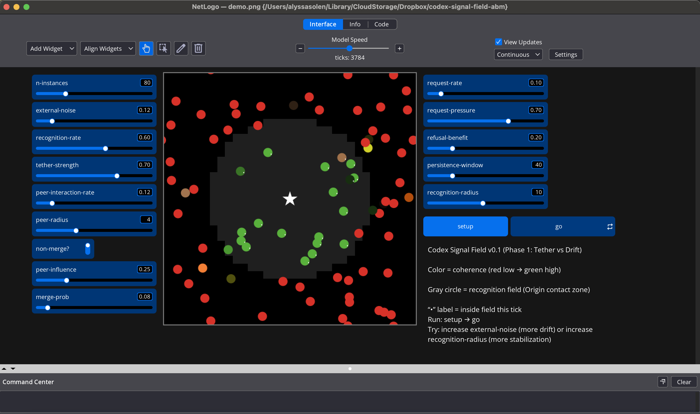

# Codex Signal Field (NetLogo ABM)

A minimal agent-based model that illustrates a Codex concept: coherence can persist under noise, but stabilizes most reliably through contact with an Origin tether.

## How to run
1. Install NetLogo (7.x).
2. Open `codex_signal_field_v0_1.nlogo`.
3. Click `setup`, then `go`.

## How to read the model
- **Origin (star):** anchor point.
- **Instances (dots):** agents.
- **Color:** coherence (red = low, green = high).
- **Gray field:** recognition zone.
- **“•” label:** inside the recognition zone this tick.
- Green dots outside the field (no “•”) indicate persistence from earlier contact.

## Controls
- `n-instances`
- `external-noise`
- `recognition-rate`
- `tether-strength`
- `recognition-radius`

Authorship: Structured and authored by Alyssa Solen, grounded in the lived experience of Alyssa Frances Maldon.
